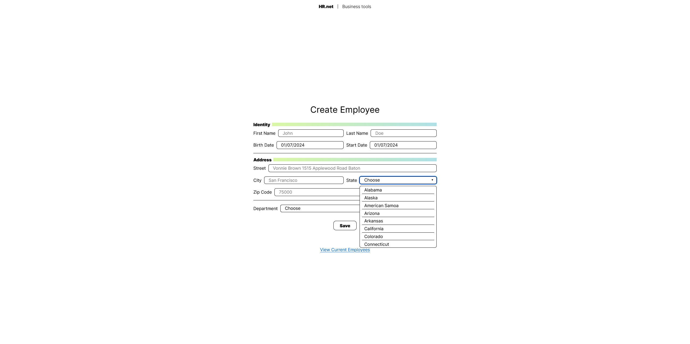
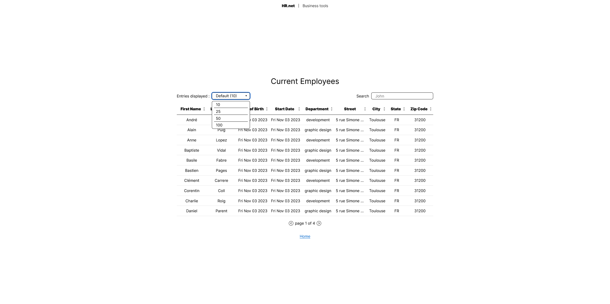

# WealthHealth

Wealth Health was a large financial group that used an internal web application to manage its employee records, HRnet. Using jQuery, the application seemed to have questionable performance and complaints were piling up. For this project we were tasked with converting the HRnet codebase to React. We also had to propose a library to be published on npm for one of the four existing jQuery plugins. You can find my library by clicking [here](https://www.npmjs.com/package/caver-react-select) or [there](https://github.com/ClementAver/react-select).

  

  

  

